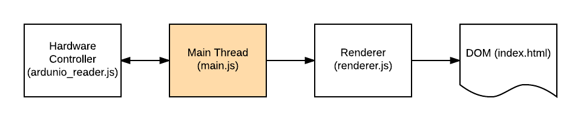

# HUD-pc

The software driving the display on the hitcho-mk4.

## Important Notes:

Hardware UART on pins 8 and 10 (GPIO 4, GPIO15) must be enabled

https://www.raspberrypi.org/documentation/configuration/uart.md